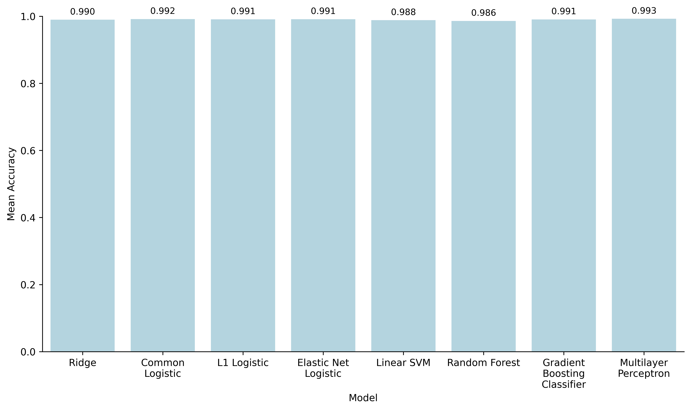

# 跨癌智筛 | Pan-Cancer Intelligent Screening

> 基于转录组数据与机器学习的跨组织癌症智能预测研究原型  
> A cross-tissue cancer prediction research prototype based on transcriptomic data and machine learning

负责人、代码作者：李牧轩

项目成员：方颖博、向颖喆、陆梓萌、叶依朵、周昕悦

指导教师：刘琬璐，副教授

[中文](#中文说明) | [English](#english)



---

## 中文说明

### 项目简介

“跨癌智筛”是浙江大学 ZJU-UoE Institute 学生团队面向中国国际大学生创新大赛（2026）开发的生物信息学研究项目。项目聚焦一个核心问题：如何从不同组织来源的高维基因表达数据中提取具有判别力的特征，并建立具备跨队列泛化能力的恶性状态分类模型。

项目整合 TCGA 肿瘤样本与 GTEx 正常组织样本，构建标准化 RNA-seq 分析流程，对 8 种基础机器学习模型进行比较，并使用独立癌种队列开展外部验证。当前仓库提供模型训练、验证、结果可视化及已训练模型文件，是项目研究原型的核心代码。

### 项目目标

- 建立癌症转录组数据整理、预处理与建模的标准化流程；
- 开发可区分肿瘤与正常组织的跨组织二分类模型；
- 从平衡准确率、F1 和 AUROC 等维度比较模型表现；
- 通过特征重要性与单变量筛选分数辅助识别潜在关键基因；
- 为后续可视化研究平台和跨队列分析服务提供技术基础。

### 数据与技术路线

项目介绍材料中的整体数据基础包括 TCGA、GTEx 与用于外部验证的公开队列，覆盖 20 余种组织、12,000 余份样本和 50,000 余个基因。仓库代码所体现的流程为：

```text
公开数据库样本
    -> 统一基因标识并合并表达矩阵
    -> log2(TPM + 1) 标准化
    -> 低方差过滤（VarianceThreshold）
    -> 单变量特征筛选（SelectKBest，保留 800 个基因）
    -> 多模型训练与五折分层交叉验证
    -> 独立癌种队列验证
    -> 性能与重要基因可视化
```

训练任务将 `status == "Tumor"` 编码为 1，其余样本编码为 0。线性模型、SVM 与 MLP 在特征筛选后进行标准化；树模型不进行标准化。随机种子统一设置为 `42`。

### 模型与评价指标

仓库比较以下 8 种模型：

1. Ridge Classifier
2. L2 Logistic Regression
3. L1 Logistic Regression
4. Elastic Net Logistic Regression
5. Linear SVM
6. Random Forest
7. Gradient Boosting Classifier（GBM）
8. Multilayer Perceptron（MLP）

主要评价指标为 balanced accuracy、F1 score 和 AUROC。项目方案选用 GBM 作为重点解释与跨队列展示模型。仓库中的基准图显示，8 个候选模型在当前内部五折分层交叉验证中的平均 balanced accuracy 均约为 0.986-0.993；这些数值属于当前数据划分下的研究结果，不代表临床性能。

### 仓库结构

```text
├── ML_final.ipynb          # 完整训练、验证、绘图流程
├── ML_final.html           # Notebook 的静态导出版本
├── Models/                 # 8 个已训练的 scikit-learn Pipeline
└── model_scores_bar.png    # 模型 balanced accuracy 对比图
```

`Data/`、`Validation/`、`Figures/`、`TPM_log.txt.gz`、`meta.csv` 和 `scores.csv` 等运行时输入/输出未包含在当前目录快照中，需要按下述约定自行准备。

### 环境依赖

- Python 3.10 或更高版本（建议）
- R 4.x（仅在重新整合原始数据时需要）
- Python：`pandas`、`numpy`、`polars`、`scikit-learn`、`matplotlib`、`seaborn`、`joblib`
- R：`tidyverse`、`data.table`

示例安装：

```bash
python -m venv .venv
# Windows: .venv\Scripts\activate
# macOS/Linux: source .venv/bin/activate
python -m pip install pandas numpy polars scikit-learn matplotlib seaborn joblib jupyter
```

### 数据准备

#### 训练数据

训练脚本期望以下文件：

```text
Data/
├── TPM_log.txt.gz
└── meta.csv
```

- `TPM_log.txt.gz`：逗号分隔的表达矩阵；第一列为基因 ID，后续列为样本；数值应已进行 `log2(TPM + 1)` 转换。
- `meta.csv`：至少包含 `sample_id`、`subject_id` 和 `status`；`status` 中的肿瘤样本标记为 `Tumor`。
- 表达矩阵的样本名必须与 `meta.csv` 中的 `sample_id` 一致。

`Merge.R` 展示了如何合并 TCGA TPM、TCGA 元数据与 GTEx TPM/元数据。运行前请修改其中硬编码的工作目录，并按脚本注释准备原始文件。公开数据的下载、授权和使用应遵守 TCGA、GTEx、GEO 及原始研究的条款。

#### 独立验证数据

验证脚本期望：

```text
Validation/
├── <cohort>.tsv.gz
└── <cohort>_meta.csv
```

验证表达矩阵同样采用“基因 × 样本”布局，第一列为基因 ID；元数据至少包含 `sample_id` 和 `status`。脚本会移除 Ensembl ID 的版本后缀、按训练特征重排，并用训练集基因均值填补缺失特征。

> 重要：`ML_valid.py` 会对验证矩阵执行 `log2(x + 1)`。因此传入该脚本的验证数据应为未取对数的 TPM 值；若数据已经是 `log2(TPM + 1)`，请移除该转换，避免重复取对数。

### 运行方式

推荐从 Notebook 逐步运行并核对本地路径：

```bash
jupyter notebook ML_final.ipynb
```

也可分别运行脚本：

```bash
# 训练 8 个模型并执行五折分层交叉验证
python ML_test.py

# 使用 Models/ 下的已训练模型验证独立队列并生成图表
python ML_valid.py
```

运行前请创建脚本所需的 `Data/`、`Validation/` 和 `Figures/` 目录，并确认文件路径与上文一致。训练脚本当前将新模型写入项目根目录；如需覆盖 `Models/` 中的模型，请先核对版本并手动移动文件。

### 输出结果

- 训练后的 scikit-learn Pipeline（`.pkl`）
- 模型交叉验证指标表（`scores.csv`）
- 模型 balanced accuracy 对比图
- 多队列 balanced accuracy、F1、AUROC 热图
- 指定癌种的 ROC 曲线
- GBM 前 20 个重要基因、SelectKBest 分数与训练损失图

### 已知限制

- 这是科研与竞赛用途的原型，不是获批医疗器械，不可用于临床诊断或治疗决策。
- 当前 `StratifiedKFold` 按标签分层，但传入的 `groups=subject_id` 不会被该划分器使用；若同一受试者有多个样本，建议改用 `StratifiedGroupKFold` 以降低信息泄漏风险。
- `Linear SVM` 未启用概率输出，现有 `_roc_auc_input()` 仅处理 `predict_proba`，因此计算该模型 AUROC 时需要改用 `decision_function`。
- 项目介绍材料中的跨队列表现和市场化规划属于阶段性研究结果与发展目标；正式转化仍需更严格的独立验证、批次效应评估、可解释性分析与合规审查。
- Pickle/Joblib 文件可能执行任意代码，只应加载可信来源的模型，并尽量使用与训练时一致的 Python 和 scikit-learn 版本。

### 代码与引用

代码仓库：<https://github.com/First-Forever/2026_Innovation>

如果本项目支持了你的研究，请在成果中注明项目名称“跨癌智筛（Pan-Cancer Intelligent Screening）”，并同时引用所使用的 TCGA、GTEx、GEO 数据集及相关方法论文。

### 许可证

当前目录未提供开源许可证。在许可证补充前，默认保留所有权利；代码、模型或衍生结果的再分发与商业使用请先联系项目团队。

---

## English

### Overview

Pan-Cancer Intelligent Screening is a bioinformatics research project developed by a student team from the ZJU-UoE Institute, Zhejiang University, for the China International College Students' Innovation Competition 2026. It addresses a central question: can discriminative features be extracted from high-dimensional gene-expression profiles across diverse tissues to build a malignancy classifier that generalizes across cohorts?

The project combines TCGA tumor samples with GTEx normal-tissue samples, establishes a standardized RNA-seq workflow, benchmarks eight machine-learning models, and evaluates them on independent cancer cohorts. This repository contains the core prototype code for training, validation, visualization, and model interpretation, together with serialized trained pipelines.

### Objectives

- Standardize cancer transcriptome curation, preprocessing, and modeling;
- Develop a cross-tissue binary classifier for tumor versus normal samples;
- Compare models using balanced accuracy, F1 score, and AUROC;
- Support discovery of potentially informative genes through feature-importance analyses;
- Provide a technical foundation for a visual research platform and cross-cohort analysis service.

### Data and workflow

The project presentation describes a data foundation spanning more than 20 tissues, 12,000 samples, and 50,000 genes from TCGA, GTEx, and public external-validation cohorts. The implemented workflow is:

```text
Public cohort data
    -> harmonize gene identifiers and merge expression matrices
    -> log2(TPM + 1) normalization
    -> low-variance filtering
    -> SelectKBest feature selection (top 800 genes)
    -> training and five-fold stratified cross-validation
    -> independent-cohort validation
    -> performance and gene-importance visualization
```

Samples with `status == "Tumor"` are encoded as 1 and all others as 0. Linear models, SVM, and MLP include standard scaling after feature selection; tree-based models do not. The fixed random seed is `42`.

### Models and metrics

The repository benchmarks Ridge Classifier, L2/L1/Elastic-Net Logistic Regression, Linear SVM, Random Forest, Gradient Boosting Classifier (GBM), and Multilayer Perceptron. The main metrics are balanced accuracy, F1 score, and AUROC. GBM is selected in the project workflow for focused external validation and interpretation.

The included benchmark figure reports mean balanced accuracy of approximately 0.986-0.993 across the eight models under the current internal five-fold stratified cross-validation setup. These are research results for the current data split and must not be interpreted as clinical performance.

### Repository layout

```text
.
├── ML_final.ipynb          # End-to-end training, validation, and plotting
├── ML_final.html           # Static export of the notebook
├── Models/                 # Eight trained scikit-learn pipelines
└── model_scores_bar.png    # Balanced-accuracy benchmark
```

Runtime inputs and outputs such as `Data/`, `Validation/`, `Figures/`, `TPM_log.txt.gz`, `meta.csv`, and `scores.csv` are not included in the current directory snapshot and must be prepared separately.

### Requirements

- Python 3.10+ recommended
- R 4.x only when rebuilding the merged dataset
- Python packages: `pandas`, `numpy`, `polars`, `scikit-learn`, `matplotlib`, `seaborn`, `joblib`
- R packages: `tidyverse`, `data.table`

```bash
python -m venv .venv
# Windows: .venv\Scripts\activate
# macOS/Linux: source .venv/bin/activate
python -m pip install pandas numpy polars scikit-learn matplotlib seaborn joblib jupyter
```

### Input preparation

For training, place `TPM_log.txt.gz` and `meta.csv` in `Data/`. The expression matrix must be comma-separated with gene IDs in its first column and samples in subsequent columns; values must already be transformed as `log2(TPM + 1)`. Metadata must include `sample_id`, `subject_id`, and `status`, with tumor samples labeled `Tumor`.

For external validation, place `<cohort>.tsv.gz` and `<cohort>_meta.csv` in `Validation/`. The validation script removes Ensembl version suffixes, restores the training feature order, and imputes missing genes using training-set means.

> Important: `ML_valid.py` applies `log2(x + 1)` to validation matrices. Its input should therefore contain unlogged TPM values. Remove that transformation if your validation matrix is already log-transformed.

`Merge.R` illustrates the TCGA/GTEx integration workflow. Update its hard-coded working directory and prepare the referenced source files before running it. All source datasets must be downloaded and used under their respective access and licensing terms.

### Usage

The notebook is the recommended entry point:

```bash
jupyter notebook ML_final.ipynb
```

Alternatively, run the scripts separately:

```bash
python ML_test.py   # train and cross-validate all models
python ML_valid.py  # validate saved models and generate figures
```

Create the expected `Data/`, `Validation/`, and `Figures/` directories first. The training script currently saves newly trained models to the repository root; verify versions before moving them into or replacing files in `Models/`.

### Outputs

- Serialized scikit-learn pipelines (`.pkl`)
- Cross-validation score table (`scores.csv`)
- Model benchmark bar chart
- Multi-cohort metric heatmaps and ROC curves
- GBM top-gene importance, SelectKBest scores, and training-loss plots

### Known limitations

- This is a research and competition prototype, not an approved medical device. It must not be used for clinical diagnosis or treatment decisions.
- `StratifiedKFold` ignores the supplied `groups=subject_id`. If subjects contribute multiple samples, consider `StratifiedGroupKFold` to reduce leakage risk.
- `Linear SVM` has no probability output, while the current `_roc_auc_input()` only handles `predict_proba`; use `decision_function` to calculate its AUROC.
- Cross-cohort claims and commercialization plans in the presentation are interim research results and development goals. Translation requires stronger independent validation, batch-effect assessment, interpretability work, and regulatory review.
- Pickle/Joblib artifacts can execute arbitrary code. Load only trusted models and use compatible Python and scikit-learn versions.

### Code and citation

Repository: <https://github.com/First-Forever/2026_Innovation>

If this project contributes to your research, please acknowledge “Pan-Cancer Intelligent Screening” and cite the original TCGA, GTEx, GEO, and methodological sources used in your analysis.

### License

No open-source license is currently included. All rights are reserved until a license is added; contact the project team before redistributing or commercially using the code, models, or derivative results.
